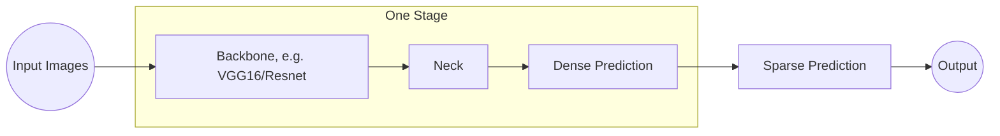

# Examples of implementation

## Diffusion 

Generation of new images from other images or text

- [Cold-Diffusion](https://arxiv.org/pdf/2208.09392.pdf) [[Code](https://github.com/arpitbansal297/Cold-Diffusion-Models)]

## Augmentation

- [`ImgAug`](https://github.com/aleju/imgaug)

## Models

- `GATO`: 16`x`16 patches in `ViT`, normalized to [-1, 1] divided by sqrt(16) (2022-05-14) (Dosovitskiy et al. 2020)

- [`YOLO`](https://github.com/ultralytics/yolov5) See [`Rhypt/examples/yolov5`] and `Yolo6`

- [`PP-YOLOE`](https://arixv.org/pdf/2203.16250.pdf)

- [`aila` `SDK`](https://ailia.jp/en) [Remark Founder David Cochard is Univ of Metz and GaTech Ms]

- [`FaceApp` - Aging with GAN](https://ml-showcase.paperspace.com/projects/cyclegan-or-age-conversion) From Paperspace using gans

- [`GauGAN` - Generation of landcapes](https://blog.paperspace.com/nvidia-gaugan-introduction)

## `YOLOv3` [`ArXiv`](https://arxiv.org/pdf/1506.02640.pdf) and [V3](https://pjreddie.com/media/files/papers/YOLOv3.pdf)

[`YOLO`](https://pjreddie.com/darknet/yolo)

Class Prediction: Does not use softmax as it imposes a single label.

### Method

Apply a single network to the entire image to divide it into regions and predict bounding boxes and probabilities for each region.

Remark: (`R-CNN` requires thousands of prediction for a single image)

Use of [`Darknet`](https://github.com/pjreddie/darknet)

## `Yolo4` [`ArXiv`](https://arxiv.org/pdf/2004.10934.pdf)

- Authors: Alexey Boxhkovskiy, Chien Yao Wang, Hong-Yuan Mark Liao

### Architecture

**0: Input**: Images, Image Pyramids

**1: Backbone: Dense Prediction**:

a. `GPU`: `VGG16`, `ResNet`, `DenseNet`, `SpineNet`, `EfficientNet`, `CSPDarkNet`

b. `CPU`: `SqueezeNet`, `MobileNet`, `ShuffleNet`

**2: Neck**:

a. Additional blocks: `SPP`, `ASPP`, `RFB`, `SAM`

b. Path-Aggregation blocks: `FPN`, `PAN`, `NAS-FPN`, Fully-Connected `FPN`,
`BiFPN`, `ASFF`, `SFAM`

**3: Heads**:

a. Dense Prediction (one-stage):

  i. Anchor Based: `RPN`, `SSD`, `YOLO`, `RetinaNet`

  ii. Anchor Free Based: `CornerNet`, `CenterNet`, `MatrixNet`, `FCOS`

b. Sparse Prediction (two-stage):

  i. Anchor Based: `R-CNN`, `R-FCN`, `Mask` `R-CNN`

  ii. Anchor Free: `RepPoints`

## `Yolo5`

No articles yet [2022-07-03]

## Scene Generation - Lightfields

GSM [Paper](https://arxiv.org/pdf/2112.01473.pdf)
[Code](https://github.com/princeton-computational-imaging/neural-point-light-fields)

## Acronyms

| Acronym   | Description              | Reference |
| --------- | ------------------------ | --------- |
| `SAM`     | Self Aggregation Module  |           |
| `PAN`     | Path Aggregation Network |           |
| `SPP`     | Spatial Pyramid Pooling  |           |
| `GSM`     |                          |           |
| `mAP`     | mean Average Precision   |           |

## Generative Art

- [`Synthetik`](https://synthetik.com/msg-generative-art/)

## Detection

- [20000 Classes](https://arxiv.org/pdf/2201.02605.pdf) [Code](https://github.com/facebookresearch/Detic)
