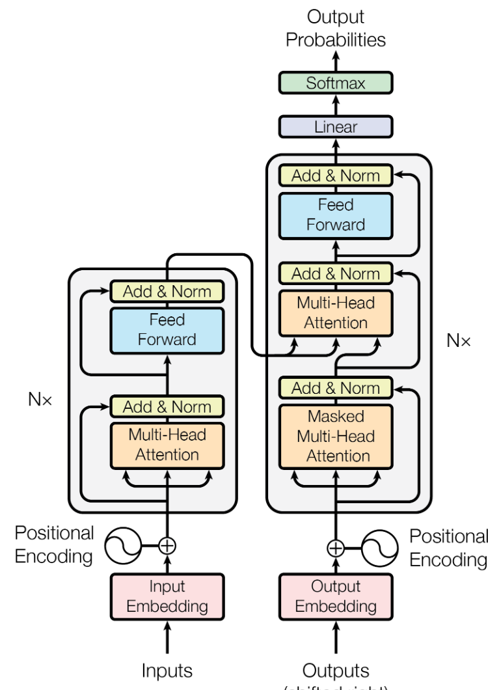
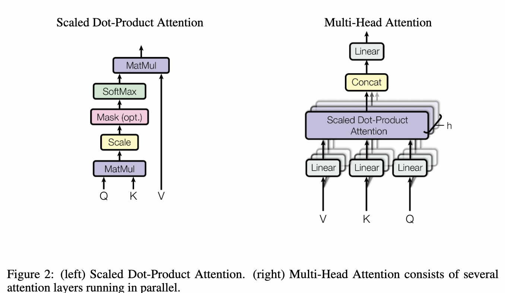

# Transformers

Used to determine the probability of a given attribute (for sentiment/name entity recognition)

## Reference

- [Attention Is All You Need, __A. Vaswani et al.__, 2017](https://arxiv.org/pdf/1706.03762.pdf)
- [Tensor2Tensor](https://github.com/tensorflow/tensor2tensor)

## Transformer

Generate Probability

### Encoder
- Stack of (6) identical layers
- The input is Embedding + positional encoding
- Each layer has 2 sub-layers
  1. Multi-head attention
  2. `LayerNorm( x + SubLayer(x) )`
  3. Fully connected feed-forward network
  4. `LayerNorm( x + SubLayer(x) )`

### Decoder

- Stack of (6) identical layers
- The input is Embedding + positional encoding (shifted by 1 position)
- Each layer has 3 sub-layers

  1. Masked Multi-head attention (to remove position)
  2. `LayerNorm( x + SubLayer(x) )`
  3. 2 sub-layers identical to the encoder with the input from the Encoder outputs

### Attention

Def: Mapping a query (`Q`) and a key(`K`)-value(`V`) pair to an output

- Input: `Q`, `K`, `V`, are vectors
- Output: Dot Product of `Q . K`(sqrt of dimension) with softmax / mask  dot product of `V`
- __Rem__: Dot product is much faster than neural network with single hidden layer (as it uses matrix multiplies, based on concatenated queries)

### Multi-head Attention

- Perform multiple projection on queries and key-values
- Concatenate and apply a final projection

### Optimization/Regularization

1. Add dropout (prob = 0.1)

## BERT (Multi-layer bidirectional transformer encoder)

- 12 Transformer layers, (Total of 110M parameters)
[Bert](https://github.com/google-research/bert)

## Library

- [Transformers](https://huggingface.co/docs/transformers/main/en/index)

## Images

- [`GPT and Images`](https://github.com/xingyizhou/GTR)
